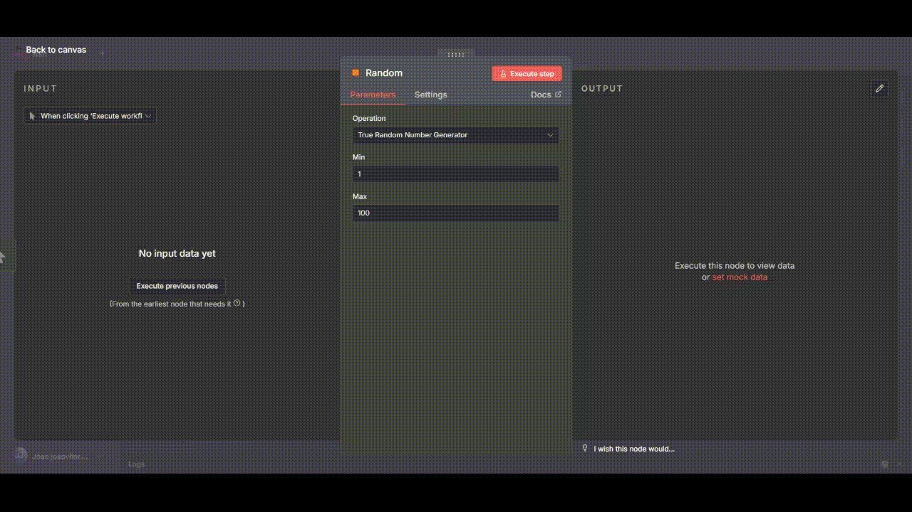

<div align="center">
  
</div>


<div align="center">
 
</div>


# Desafio n8n: Node Customizado "Random"

Este projeto é uma solução para o desafio tecnico de criar um conector (node) personalizado. O node se chama `Random` e gera um número aleatório "verdadeiro" (True Random) utilizando a API`random.org`.

---

## Funcionalidades

* **Node:** `Random`
* **Operação:** `True Random Number Generator`
* **Inputs:** `Min` (mínimo, inclusivo) e `Max` (máximo, inclusivo).
* **Output:** Retorna um JSON com o número aleatório gerado, e os valores de `min` e `max` utilizados na requisição.

Exemplo de saída:

```json
{
  "randomNumber": 42,
  "min": 1,
  "max": 100
}
```

---

## Pré-requisitos

Para rodar este projeto localmente, é necessário ter as seguintes ferramentas instaladas:

* [Node.js](https://nodejs.org/) 
* [NPM](https://www.npmjs.com/) 
* [Docker](https://www.docker.com/products/docker-desktop/) e [Docker Compose](https://docs.docker.com/compose/)
---

## Como Instalar e Rodar Localmente

Siga os passos abaixo para testar o node em uma instância local do n8n.

### 1. Clonar o Repositório

```bash
git clone https://github.com/joaoVGvieira/desafioTecnico.git
cd desafioTecnico
```

### 2. Instalar as Dependências

Este comando lê o arquivo `package.json` e instala todas as ferramentas necessárias para o desenvolvimento, como o TypeScript e as bibliotecas base do n8n.  

> **Observação:** Caso apareça algum aviso ou erro durante a instalação, **pode ignorar** e seguir para o próximo passo. Isso **não compromete** a execução do desafio.

```bash
npm install
```

### 3. Compilar o Node

O código do node está escrito em TypeScript na pasta `nodes`. Antes do n8n carregar o node, é necessário compilar para JavaScript (pasta `dist`).

```bash
npm run build
```

Esse comando executa o script `build` definido no `package.json` e gera os artefatos na pasta `dist`.

### 4. Rodar o Ambiente Docker (n8n + Postgres)

Este comando utiliza o `docker-compose.yml` para iniciar os containers do n8n e do banco de dados Postgres.

```bash
docker-compose up
```

Se preferir rodar em background (detached mode):

```bash
docker-compose up -d
```

O container do n8n está configurado para carregar automaticamente o node customizado que está na pasta `dist` (através de um volume mapeado). Aguarde até ver a mensagem nos logs indicando que o editor está disponível:

```
Editor is now accessible via: http://localhost:5678
```

### 5. Testando

Após o container do n8n iniciar, abra seu navegador no endereço: `http://localhost:5678`.

> **Observação:** Se for a primeira vez que você está usando o n8n, será solicitado criar uma conta de usuário.

1. Crie um novo workflow (`New workflow`).
2. Clique no `+` para adicionar um node.
3. Na barra de busca, digite `Random`.
4. Clique no node para adicioná-lo ao canvas.
5. Configure os campos `Min` e `Max` (ex: 1 e 100).
6. Clique em **Execute Node** (o botão de play no painel do node).
7. Verifique o resultado na aba **Output** — deverá conter o JSON com o número aleatório.

---